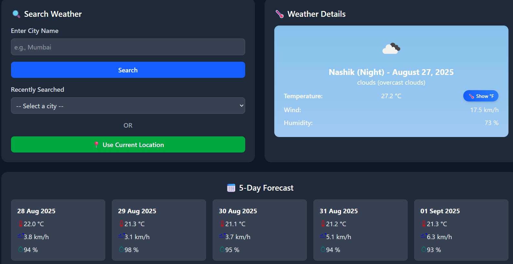

# **🌤️ Weather App**

A simple and responsive weather application built with JavaScript, TailwindCSS, and the OpenWeatherMap API.
It allows users to:

Search weather by city name

Get the weather for their current location

View current weather details (temperature, humidity, wind speed, conditions)

Toggle temperature between Celsius (°C) and Fahrenheit (°F)

Display 5-day forecast with date, temperature, wind, and humidity

Store recently searched cities in localStorage with a scrollable dropdown

**🚀 Features**

✅ Current location weather detection
✅ Search weather by city name
✅ Temperature toggle (°C ↔ °F)
✅ 5-day forecast with date & weather details
✅ Stylish dark mode UI with TailwindCSS
✅ Scrollable dropdown for recently searched cities
✅ Error handling (e.g., invalid city, invalid API key, too many requests)
✅ Dynamic weather backgrounds (clear, cloudy, rainy, snowy)
✅ Alerts for extreme heat (>40°C)

**🛠️ Tech Stack**

HTML5

TailwindCSS (CLI build)

JavaScript (Vanilla)

OpenWeatherMap API

**⚙️ Setup Instructions**

Clone this repository:

git clone https://github.com/your-username/weather-app.git
cd weather-app

Install TailwindCSS CLI if not already installed:

npm install -D tailwindcss
npx tailwindcss init

Add this to your tailwind.config.js (if not already):

module.exports = {
  content: ["./*.html", "./src/**/*.{js,ts,jsx,tsx}"],
  theme: {
    extend: {},
  },
  plugins: [],
}

Build Tailwind CSS:

npx tailwindcss -i ./src/input.css -o ./dist/output.css --watch

Open the index.html in your browser.

**🔑 API Key Setup**

This project uses OpenWeatherMap API
.

Create a free account on OpenWeatherMap.

Get your API key from the dashboard.

Replace the placeholder apiKey in script.js with your key:

const apiKey = "YOUR_API_KEY_HERE";

**📸 Screenshots**
🌑 **Dark Mode**

**Search with recently added city**

**Use of current location**

**🔍 Search with Recent Cities**

(Scrollable dropdown for previously searched cities)

**👨‍💻 Author**

Made with ❤️ by Aniket Rahalkar